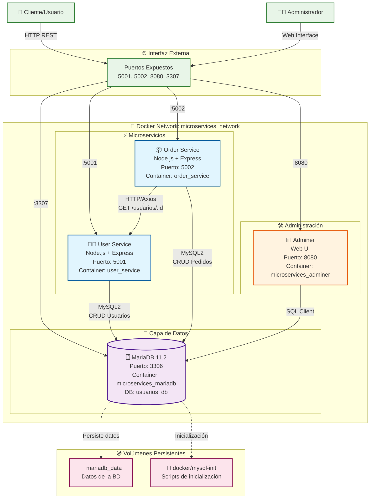
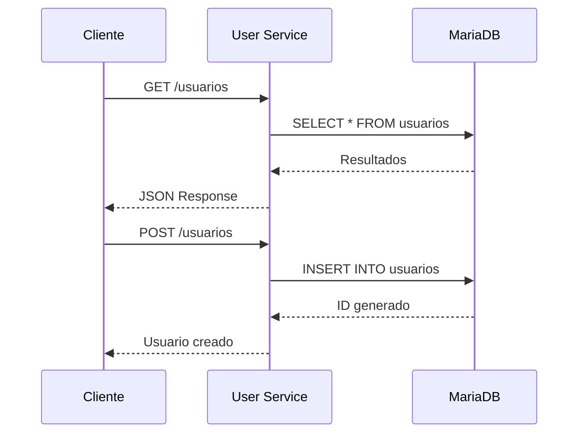
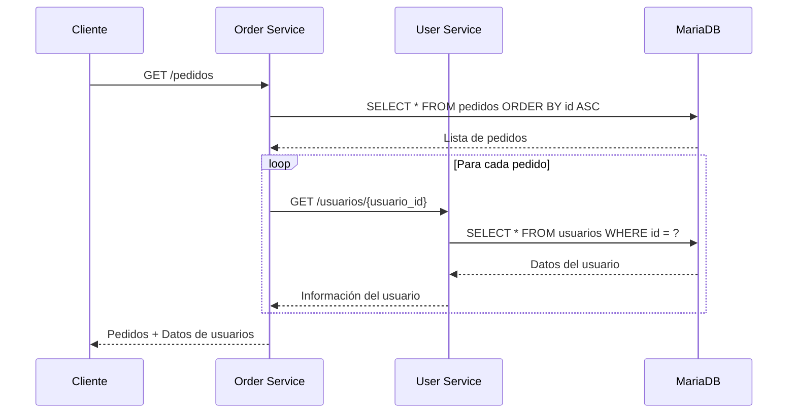

# 🏗️ Arquitectura del Sistema de Microservicios

## 📊 Diagrama de Arquitectura



## 🔄 Flujo de Datos

### 1. **Gestión de Usuarios**


### 2. **Gestión de Pedidos con Integración**


## 🏗️ Componentes del Sistema

### **Microservicios**

| Servicio | Puerto | Responsabilidades | Tecnologías |
|----------|--------|-------------------|-------------|
| **User Service** | 5001 | • CRUD de usuarios<br/>• Validaciones<br/>• API REST | Node.js, Express, MySQL2 |
| **Order Service** | 5002 | • CRUD de pedidos<br/>• Integración con usuarios<br/>• Enriquecimiento de datos | Node.js, Express, MySQL2, Axios |

### **Base de Datos**

| Componente | Puerto | Descripción | Configuración |
|------------|--------|-------------|---------------|
| **MariaDB** | 3306 (3307 externo) | • Almacenamiento principal<br/>• UTF-8 completo<br/>• Datos de ejemplo | Charset: utf8mb4<br/>Collation: utf8mb4_unicode_ci |

### **Herramientas**

| Herramienta | Puerto | Propósito | Acceso |
|-------------|--------|-----------|--------|
| **Adminer** | 8080 | Administración web de BD | http://localhost:8080 |

## 🔐 Seguridad y Configuración

### **Variables de Entorno**
```env
# Base de datos
DB_HOST=mariadb
DB_PORT=3306
DB_USER=app_user
DB_PASSWORD=root
DB_NAME=usuarios_db

# Servicios
USER_SERVICE_PORT=5001
ORDER_SERVICE_PORT=5002
USER_SERVICE_URL=http://user-service:5001
NODE_ENV=production
```

### **Health Checks**
- ✅ MariaDB: `mariadb-admin ping`
- ✅ User Service: `wget http://localhost:5001/health`
- ✅ Order Service: `wget http://localhost:5002/health`

## 📡 Endpoints API

### **User Service (Puerto 5001)**
```
GET    /usuarios        # Listar usuarios
GET    /usuarios/:id    # Obtener usuario
POST   /usuarios        # Crear usuario
PUT    /usuarios/:id    # Actualizar usuario
DELETE /usuarios/:id    # Eliminar usuario
GET    /health          # Health check
```

### **Order Service (Puerto 5002)**
```
GET    /pedidos         # Listar pedidos + datos de usuarios
GET    /pedidos/:id     # Obtener pedido + datos de usuario
POST   /pedidos         # Crear pedido
PUT    /pedidos/:id     # Actualizar pedido
DELETE /pedidos/:id     # Eliminar pedido
GET    /health          # Health check + integración
```

## 🛠️ Tecnologías Utilizadas

- **Runtime**: Node.js 18 Alpine
- **Framework**: Express.js
- **Base de Datos**: MariaDB 11.2
- **HTTP Client**: Axios
- **Contenedores**: Docker + Docker Compose
- **Administración**: Adminer
- **Arquitectura**: Microservicios RESTful

## 🚀 Despliegue

```bash
# Iniciar todo el sistema
docker-compose up --build -d

# Verificar servicios
docker-compose ps
curl http://localhost:5001/health
curl http://localhost:5002/health

# Acceder a Adminer
open http://localhost:8080
```

## 📈 Escalabilidad

Este diseño permite:
- ✅ Escalado horizontal de servicios
- ✅ Separación de responsabilidades
- ✅ Comunicación asíncrona
- ✅ Tolerancia a fallos
- ✅ Monitoreo independiente